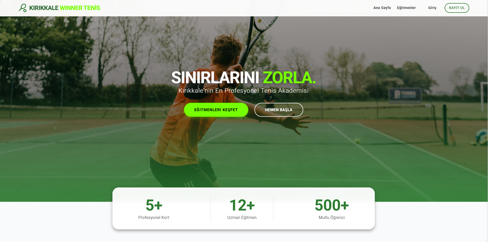
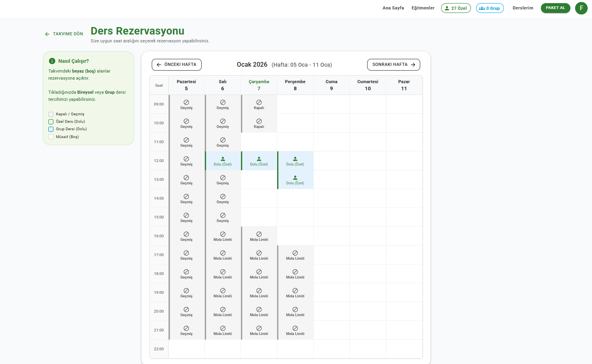
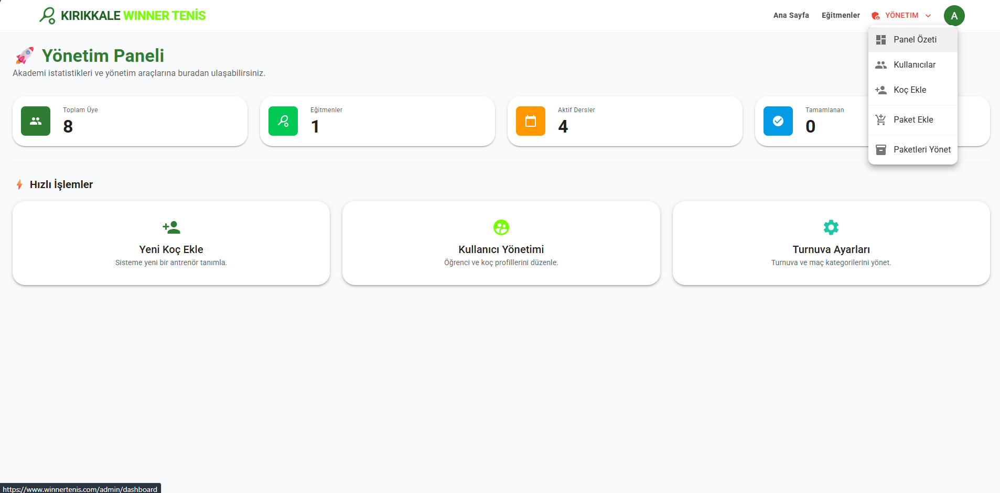

 

  

  <h1 align="center">Winner Tenis - Kort Rezervasyon Sistemi</h1>

  

    Kırıkkale Winner Tenis Kulübü için geliştirilmiş; modern, hızlı ve güvenli kort rezervasyon yönetim platformu.
     
    <a href="https://winnertenis.com"><strong>Canlı Projeyi Görüntüle »</strong></a>
     
     
    <a href="https://winnertenis.com/api/swagger">API Dokümantasyonu</a>
    ·
    <a href="#hata-bildirimi">Hata Bildir</a>
    ·
    <a href="#iletisim">İletişim</a>
  

---

## 📋 Proje Hakkında

**Winner Tenis**, tenis severlerin kort rezervasyonlarını kolayca yapabilmesi ve kulüp yönetiminin tüm süreçleri dijital ortamda takip edebilmesi için tasarlanmış kapsamlı bir web uygulamasıdır. 

Proje, **Blazor WebAssembly** teknolojisi kullanılarak Single Page Application (SPA) mimarisinde geliştirilmiş olup, arka planda **ASP.NET Core Web API** ile güçlü bir RESTful servis mimarisine sahiptir. Güvenlik altyapısı **Cloudflare** ve **SSL** ile güçlendirilmiştir.

### 🚀 Öne Çıkan Özellikler

* **📅 Akıllı Takvim Yönetimi:** Kullanıcılar boş saatleri anlık olarak görüntüleyip rezervasyon yapabilir.
* **💳 Kredi & Cüzdan Sistemi:** Kullanıcılar paket satın alabilir, bakiyelerini yönetebilir.
* **🎁 Admin Yönetimi & Hediye Kredi:** Yönetici paneli üzerinden kullanıcılara kredi tanımlama ve kort yönetimi.
* **🔒 Güvenli Ödeme:** Iyzico entegrasyonu ile güvenli online ödeme altyapısı.
* **📱 Mobil Uyumlu:** Responsive tasarım ile tüm cihazlarda sorunsuz deneyim (PWA desteği yolda).
* **🛡️ Gelişmiş Güvenlik:** JWT tabanlı kimlik doğrulama, Cloudflare koruması ve HTTPS zorunluluğu.

---

## 📷 Ekran Görüntüleri

| Ana Sayfa | Rezervasyon Ekranı |
|:---:|:---:|
|  |  |

| Mobil Görünüm | Admin Paneli |
|:---:|:---:|
|  |  |

*(Not: Ekran görüntüleri geliştirme aşamasındadır.)*

---

## 🛠️ Kullanılan Teknolojiler

Bu proje aşağıdaki teknoloji yığını (tech stack) kullanılarak geliştirilmiştir:

### Frontend (İstemci)
* **Framework:** Blazor WebAssembly (WASM)
* **Dil:** C# / Razor / HTML5 / CSS3
* **HTTP Client:** Axios benzeri .NET HttpClient yapısı

### Backend (Sunucu)
* **Framework:** ASP.NET Core 8.0 Web API
* **Veritabanı:** Microsoft SQL Server (MSSQL)
* **ORM:** Entity Framework Core (Code First yaklaşımı)
* **Auth:** JWT (JSON Web Token) Bearer Authentication

### DevOps & Altyapı
* **Hosting:** IIS (Windows Server)
* **CDN & DNS:** Cloudflare
* **SSL:** Let's Encrypt & Cloudflare Universal SSL

---

## 📞 İletişim

**Geliştirici:** [Muhammed Fatih Erdem]  
**E-Posta:** [mm.fatiherdem@gmail.com]  
**Proje Linki:** [https://winnertenis.com](https://winnertenis.com)

---

Made with ❤️ for Tennis Lovers

